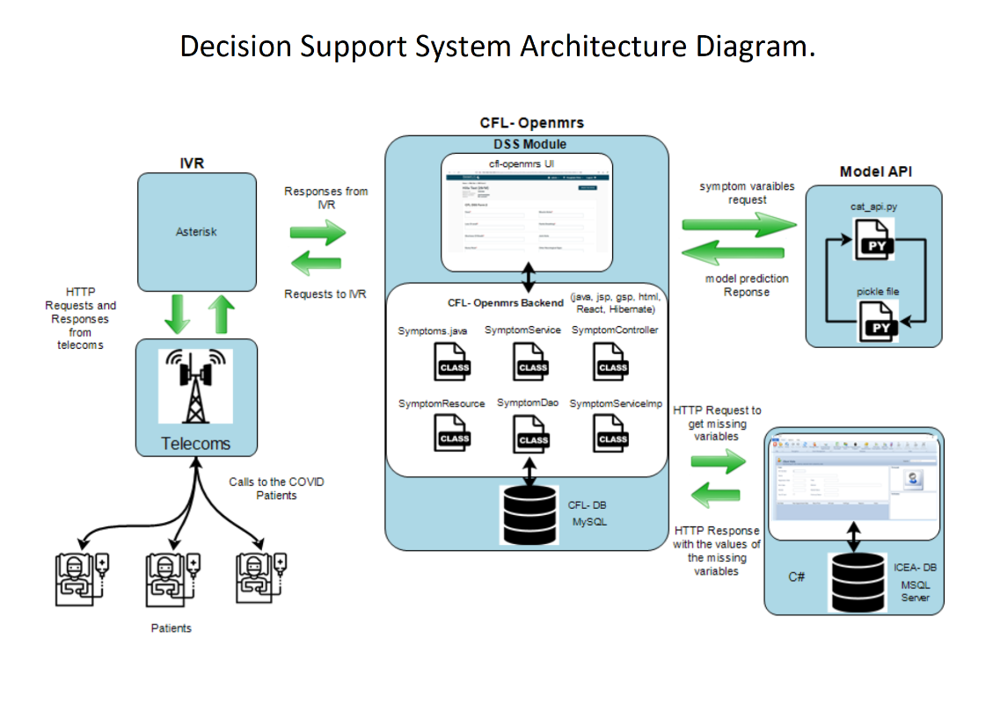

# openmrs-module-dss
Decision support system for supporting Artificial intelligency(COAST) 

 
 

 #Openmrs-module-DSS

## Description
DSS Module provides functionality of sending a request to the AI server and get response back. In this case a request that is sent on the AI is a combination of symptoms from the openmrs HtmlForms.

##How to use this DSS module
1. A Form is created with different observations,As our priority we only needed concepts with either YES or No , so we needed to edit concepts based on out need. Not that this might not be adhered from openmrs community if we need to edit concepts,this has to be done individually not globally.

2. Load this module into running reference application basing on platform version 2.3 ++.

3. Configure the form to be able to see it on the patient dashboard.

4. Find any patient and start a visit, Then click on the form under general Actions. 

5. capture observations and save, Upon saving, you will be able to send all the obs on to the live server and get response on the form itself, you will be able to a message from the server.

## Prerequisites

#### JDK 1.7 and/or JDK 1.8
To make sure that you have JDK installed properly enter in console or terminal:

on Windows:

`"%JAVA_HOME%/bin/java.exe" -version`

on Linux/Mac:

`"$JAVA_HOME/bin/java" -version`

It should display your java version. If you do not have installed Java please follow 
[Oracle's guide](https://docs.oracle.com/cd/E19182-01/820-7851/inst_cli_jdk_javahome_t/) to install.

#### Maven 3.x
To make sure that you have Apache Maven 3.x installed, open a console/terminal and enter:

`mvn -v`

You should see your Maven version. If you do not have installed please go ahead and install it. 
Here are tutorials for [Windows](https://docs.oracle.com/cd/E19182-01/820-7851/inst_cli_jdk_javahome_t/), 
[MacOSX](https://www.journaldev.com/2348/how-to-install-maven-on-mac-os-x-mavericks-10-9), 
[Ubuntu](https://www.mkyong.com/maven/how-to-install-maven-in-ubuntu/).

#### OpenMRS SDK

To start work with OpenMRS modules you will need to setup the OpenMRS SDK. In terminal or console enter a command:

`mvn org.openmrs.maven.plugins:openmrs-sdk-maven-plugin:setup-sdk`

After proper command executing you can make sure the OpenMRS SDK works fine.

`mvn openmrs-sdk:help`

It should produce the following output:

[INFO] Scanning for projects...

[INFO]

[INFO] ------------------------------------------------------------------------

[INFO] Building Maven Stub Project (No POM) 1

[INFO] ------------------------------------------------------------------------

[INFO]

[INFO] --- openmrs-sdk-maven-plugin:3.0.0:help (default-cli) @ standalone-pom ---
 
OpenMRS SDK *your-version-of-OpenMRS-SDK*

If that is the case, you have installed the SDK successfully.

For more info, see SDK documentation: https://wiki.openmrs.org/display/docs/OpenMRS+SDK

## Building from Source
You will need to have Java 1.8+ and Maven 3.x+ installed.  Use the command 'mvn package' to 
compile and package the module.  The .omod file will be in the omod/target folder.

Alternatively you can add the snippet provided in the [Creating Modules](https://wiki.openmrs.org/x/cAEr) page to your 
omod/pom.xml and use the mvn command:

    mvn package -P deploy-web -D deploy.path="../../openmrs-1.8.x/webapp/src/main/webapp"

It will allow you to deploy any changes to your web 
resources such as jsp or js files without re-installing the module. The deploy path says 
where OpenMRS is deployed.

## Installation
1.Build the module to produce the .omod file using:

`mvn clean install`

You can build .omod file skipping the tests:

`mvn clean install -DskipTests`

It creates *.omod file in omod/target directory.

**Note:** Building the module takes some time because during module building static code analysis are executed.
If you want to build the module faster (during the developing) then you can use maven profile:

_dev_ - disable executing of static code analysis tools

Example of usage: `mvn clean install -P dev`

